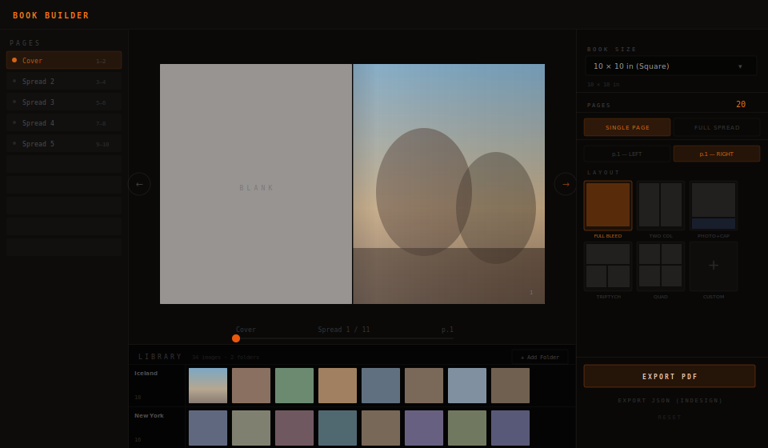

# Book Builder

A browser-based tool for laying out photobooks and zines. Drag your photos onto pages, pick a layout, and export a print-ready PDF — all without leaving the browser.



---

## What it does

You load folders of photos from your computer. They show up as contact sheets at the bottom of the screen — one row per folder, scrolling sideways. Then you drag photos onto the pages in the middle.

Each page can have its own layout: full bleed, two columns, a photo with a caption, a grid of four, and so on. You can also design a spread — one image or layout that runs across both pages of an open book.

Switch to **Zine mode** for a different set of sizes and layouts built around folded-paper formats: half-letter, A5, quarter-fold. Zine layouts are text-heavy, asymmetric, raw — body copy, pull quotes, collage grids, film strips.

Once everything looks right, hit **Export PDF** and it renders each page to a file you can send to a printer or a copy shop.

---

## Features

### Book mode
- **Industry book sizes** — 8×8, 10×10, 11×8.5, 12×12 and more, plus custom inch input
- **14 layout presets** — full bleed, two-column, triptych, grid, photo+caption, text-only, and others
- **Full-spread layouts** — designs that cross the gutter as one canvas

### Zine mode
- **Zine sizes** — Half Letter (5.5×8.5), Quarter (4.25×5.5), A5, A6, Letter
- **12 zine layouts** — Body Copy, Masthead, Film Strip, Raw Two, Collage Three, Pull Quote, Four Panel, Back Cover, and more
- Built for the copy-shop workflow: half-letter = fold one sheet of paper, cut, staple

### Both modes
- **Freeform custom layout** — place image and text slots anywhere by entering percentages
- **Photo adjustment** — drag to pan, scroll to zoom, click Done to commit
- **Typeable text slots** — click any text slot and start typing
- **Per-page independence** — left and right pages have completely separate layouts
- **PDF export** — canvas-rendered at 150 DPI, correct crop and zoom math
- **JSON export** — structured layout data for InDesign scripting

---

## How to use it

1. Open the app in Chrome or Edge (requires File System Access API)
2. Pick **Book** or **Zine** in the top-right panel
3. Click **+ Add Folder** in the library and pick a folder of photos — they load as a contact sheet row
4. Use the arrows or slider to navigate to the page you want
5. Pick a layout from the right panel
6. Drag a thumbnail from the bottom strip onto a slot on the page
7. To adjust the crop, hover the photo and click **Adjust** — drag to pan, scroll to zoom, click **Done**
8. Click **Export PDF** to download the finished book

---

## Zine folding reference

| Format | Size | How to make |
|---|---|---|
| Half Letter | 5.5 × 8.5 in | Fold US letter in half lengthwise |
| Quarter | 4.25 × 5.5 in | Fold letter in quarters |
| A5 | 5.83 × 8.27 in | European half-A4 |
| A6 | 4.13 × 5.83 in | Quarter A4 |
| 8-page one-sheet | 8.5 × 11 in pages | Print front+back, fold in half 3× then cut center spine |

---

## Run it locally

```bash
cd app
npm install
npm run dev
```

Then open `http://localhost:5173`.

---

## Build and deploy

```bash
cd app
npm run build
# copy dist/ to your web server
```

The app builds to `/book-builder/` base path. To change it, edit `app/vite.config.ts`:

```ts
base: '/your-path/'
```

Add an nginx SPA fallback:

```nginx
location /book-builder/ {
  try_files $uri $uri/ /book-builder/index.html;
}
```

---

## Stack

- React 18 + TypeScript
- Zustand (state)
- Tailwind CSS
- Vite
- jsPDF + Canvas 2D (PDF export)

---

## Browser support

Works in **Chrome** and **Edge**. The folder picker uses the File System Access API which Safari and Firefox do not fully support yet.
